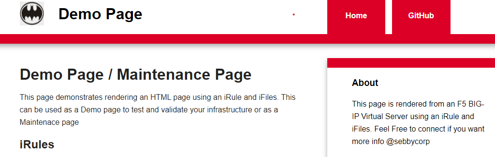

# Demo of BIG-IP Hosted Page and Maintenance page

The Simple Maintenace Page Folder contain a simple HTML Maintenace Page that can be applied to an virtual server and is executed when the VS is down.

The Advanced hosted Page is more advanced and can be used to host a full blow website using irules and ifiles on an F5

